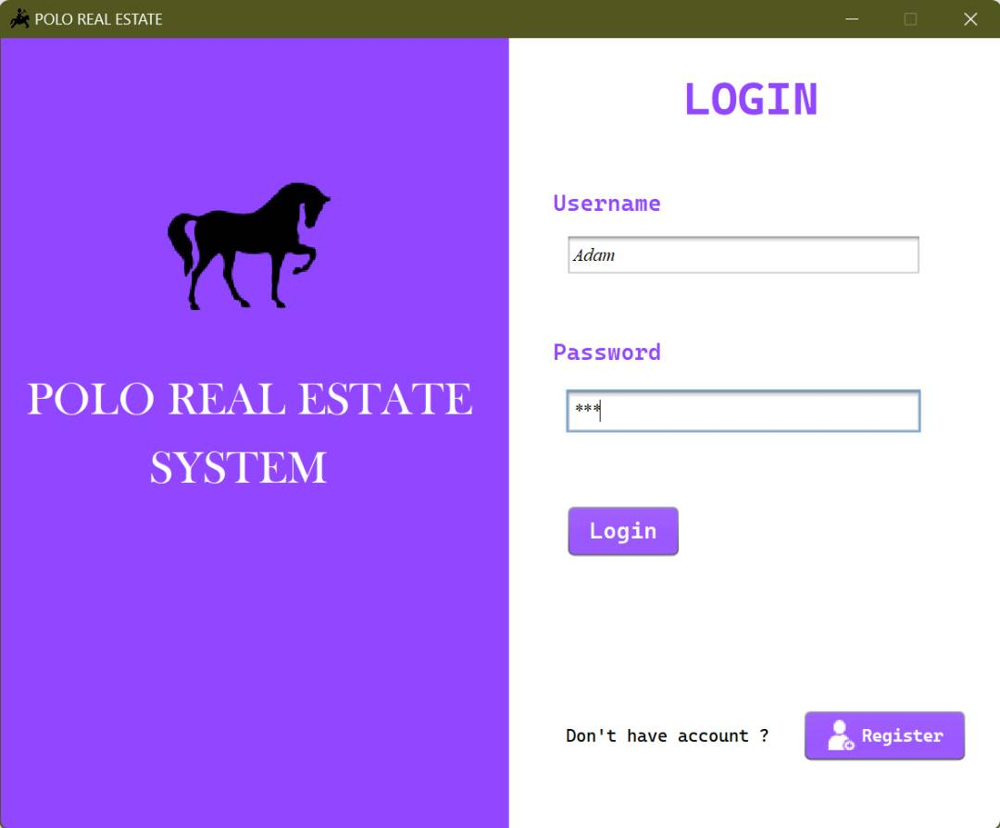

# Real-Estate-Management-System
A simple terminal-based software designed to facilitate the buying, selling, and renting of properties.
The app read the data from the provided csv file which list out all the available properties in the area

# Screenshot of App Interface

